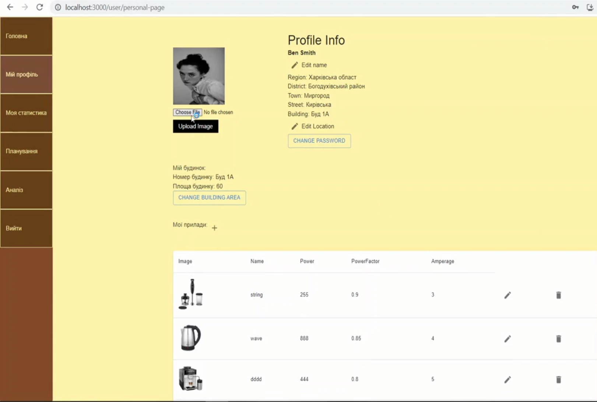
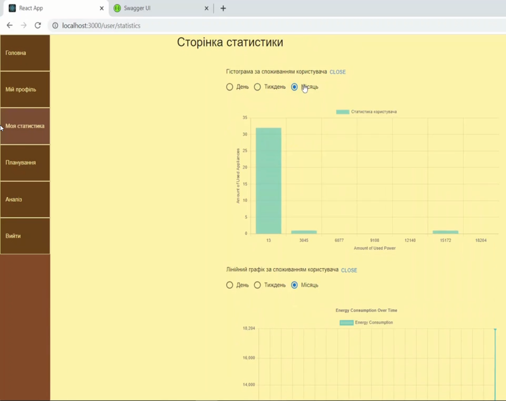
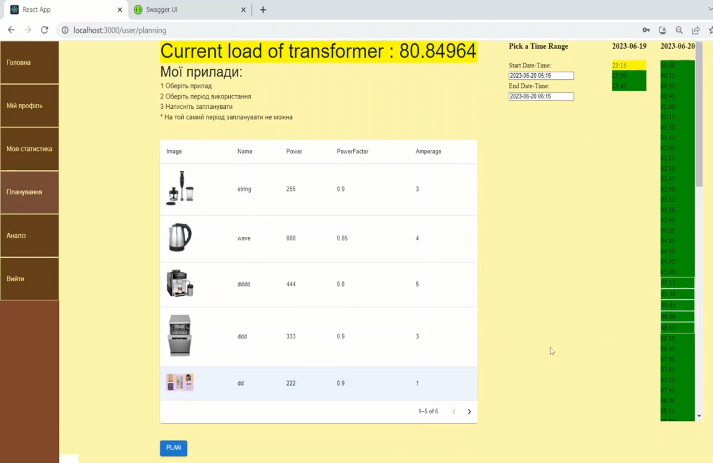
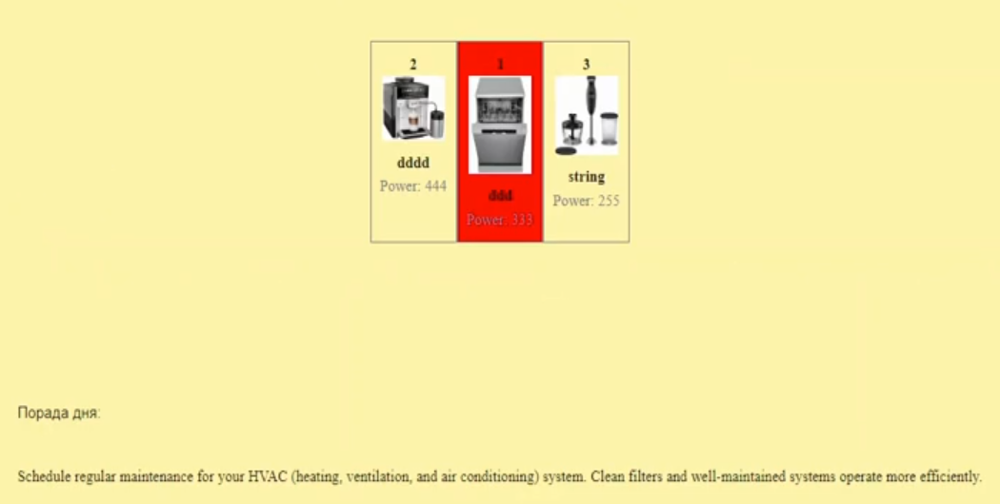

In this project we study the field of energetics and energy efficiency. 
The object of development is a server application for optimizing the voltage level in the power grid by letting the users schedule their appliance usages and providing them with current transformer load.
The app also provides a profile system, statistics for user, administration system. 
Analysis of appliance efficiency is available to premium users. 
Premium status is obtainable through making a purchase via LiqPay system. The app also has a google sign-in feature.

